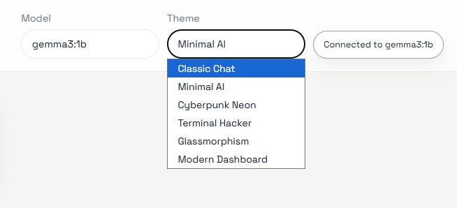
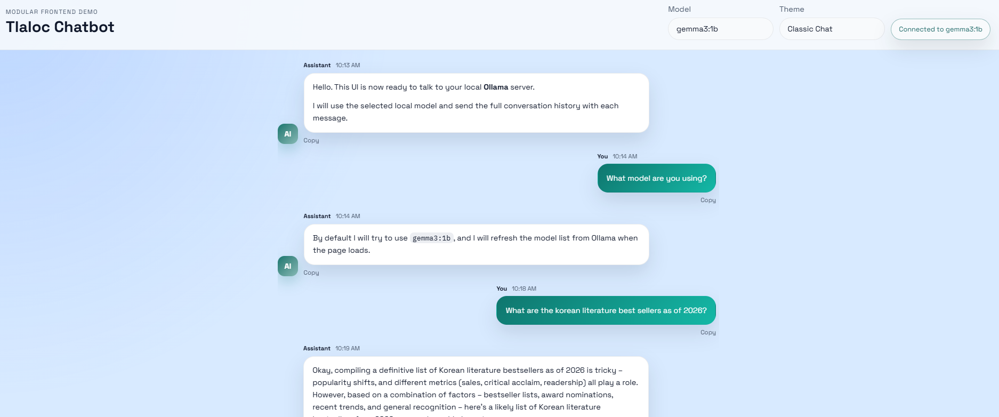
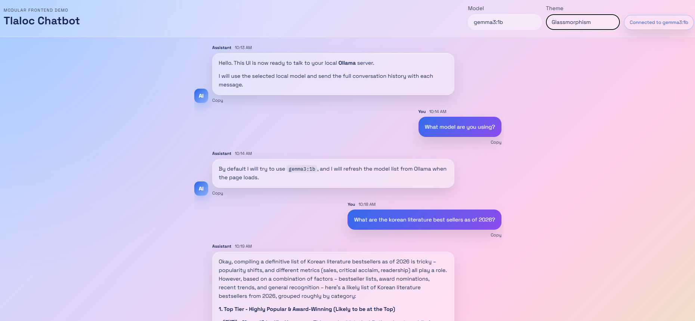
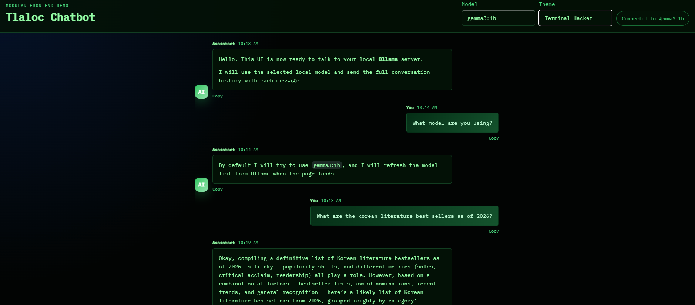
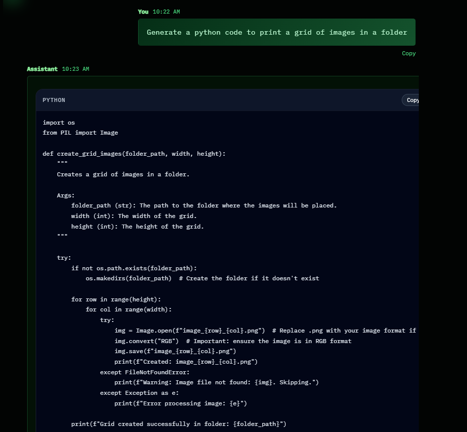

# Tlaloc Chatbot UI

Tlaloc Chatbot UI is a modular, frontend-only chatbot interface built with plain HTML, CSS, and JavaScript. It was designed as a modern local chat client that can switch between multiple visual styles while connecting directly to a locally running [Ollama](https://ollama.com/) instance.

The project focuses on:

- A clean and extendable component structure
- Multiple selectable chatbot themes
- Responsive layout for desktop and mobile
- Markdown-style assistant responses with code blocks
- Copy actions for both full messages and generated code snippets
- Local model inference through Ollama without adding a backend

## Features

- Chat history with user and assistant message bubbles
- Assistant avatar and per-message timestamps
- Typing indicator animation
- Auto-scroll to the newest message
- Dynamic theme switching with CSS variables
- Model selector populated from local Ollama models
- Connection status badge for the local Ollama server
- Code block rendering with `Copy code` support
- Full message copy button

## Included Themes

The UI currently supports six themes:

1. Classic Chat
2. Minimal AI
3. Cyberpunk Neon
4. Terminal Hacker
5. Glassmorphism
6. Modern Dashboard

Theme styles are defined in [`themes.css`](./themes.css), while shared layout and component styling lives in [`styles.css`](./styles.css).

## Project Structure

```text
TLALOC-CHATBOT/
|-- index.html
|-- styles.css
|-- themes.css
|-- app.js
|-- README.md
`-- img/
    |-- ClassicChat.png
    |-- DifferentDesigns.png
    |-- Glassmorphism.png
    |-- HackerDesign.png
    `-- TherminalHacker.png
```

## How It Works

The app loads in the browser as a static frontend. On startup it tries to reach the local Ollama API at:

```text
http://127.0.0.1:11434
```

It uses:

- `GET /api/tags` to discover available local models
- `POST /api/chat` to send the conversation history and receive a model response

This means the project stays backend-free while still supporting real local AI chat.

## Running the Project

Because browsers often restrict API calls from `file://` pages, run the app through a local static server.

### Option 1: Python

```powershell
cd D:\extrastudy\TLALOC-CHATBOT
python -m http.server 5500
```

Then open:

```text
http://localhost:5500
```

### Option 2: Any Static Server

You can also use VS Code Live Server, `npx serve`, or any equivalent local static server.

## Ollama Setup

Make sure Ollama is running locally before opening the app.

Useful commands:

```powershell
ollama --version
ollama ls
ollama run gemma3:1b
```

The app automatically detects installed models and lets you select one from the header.

## Screenshots

The repository includes screenshots in the [`img`](./img) folder.

### Design Gallery



### Classic Chat



### Glassmorphism



### Hacker Style



### Terminal Hacker



## Main Files

- [`index.html`](./index.html): Main application structure and layout
- [`styles.css`](./styles.css): Shared component styling and layout rules
- [`themes.css`](./themes.css): Theme variable overrides and theme-specific presentation
- [`app.js`](./app.js): Chat behavior, markdown rendering, Ollama API integration, copy actions, and UI state

## Extension Ideas

This project is intentionally easy to extend. Good next steps include:

- Streaming responses from Ollama
- Chat persistence with `localStorage`
- Conversation switching in the dashboard sidebar
- System prompt controls
- Syntax highlighting for code blocks
- Export chat history

## Notes

- No backend is required for the current version
- Ollama must be running locally for live responses
- If the Ollama connection fails, the UI shows an inline help message

